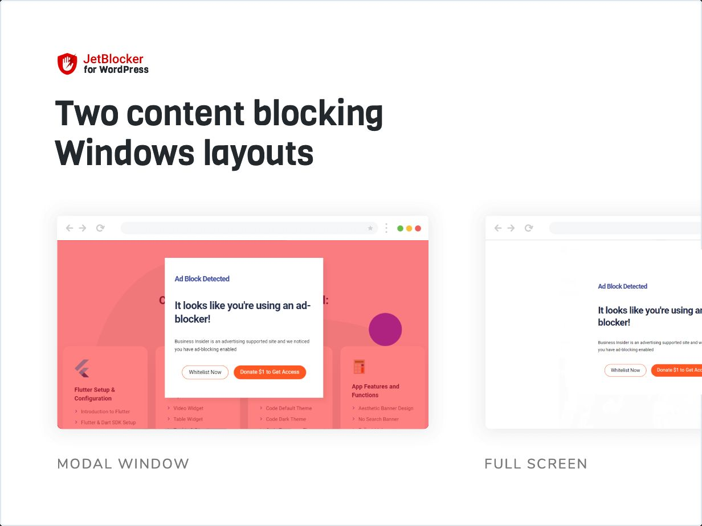
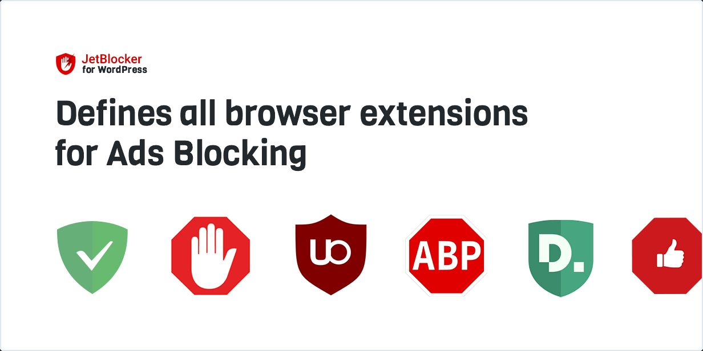
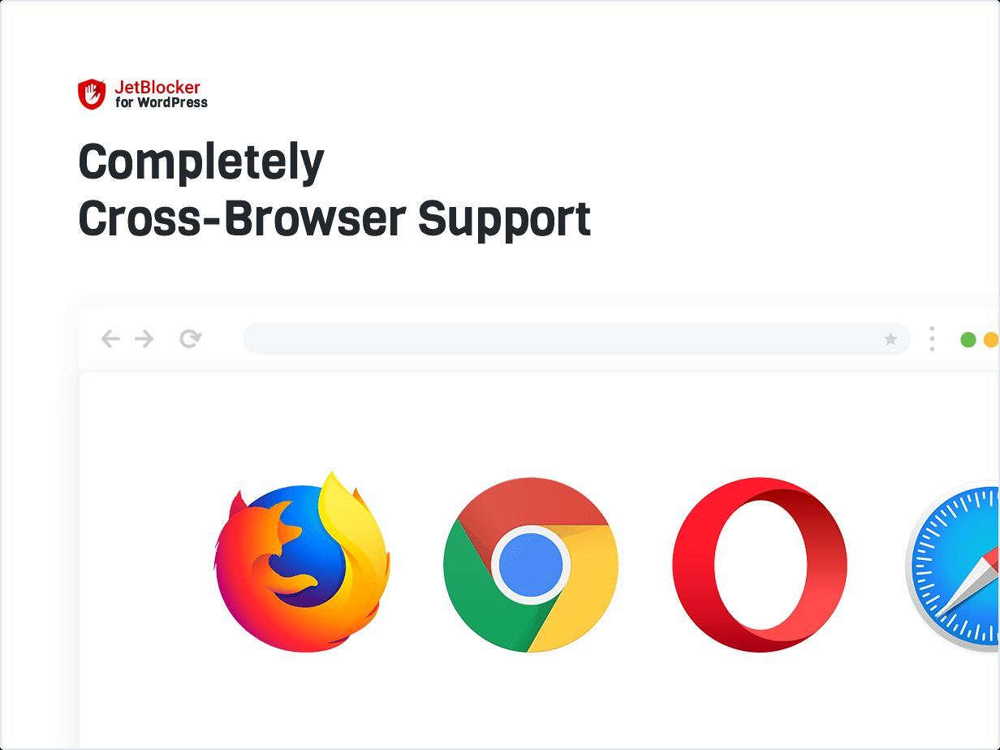

## JetBlocker Anit AdBlocker Detector Free
## [Download from WordPress.org ]https://wordpress.org/plugins/jet-blocker-anti-ad-blocker-detector/)

JetBlocker is a powerful tool and money-saving plugin for websites created by WordPress. The goal of this Plugin is to ask a website visitor to disable browser extensions that block ads. 

## Support Developer

### [Buy Me a Coffee](https://www.buymeacoffee.com/danishlaeeq)
### [PayPal](https://www.paypal.com/paypalme/makstudioo/5usd)

## Description 

### Plugin Main features
- The Plugin defines all Ad Blocker extensions
- Works well with all WordPress Themes
- Perfect for RTL
- Native Valid JavaScript, without jQuery
- Tested and Compatible up to WordPress 5.2
- Lightweight and Fast
- Compatible with all Modern Browsers
- Compatible with WooCommerce
- All major browsers supported Chrome, Firefox, Safari, Edge, Opera
- Easy to use and customize
- Awesome for Mobile and Tablets
- Installation Guide
- Huge Customization Capabilities

### What Can You Do With This Plugin?
JetBlocker is designed to block the use of AdBlocker extensions maximally. The user will not be able to open the context menu, not be able to select and copy something on the page, and will not be able to use

The plugin works perfectly with all significant WordPress frameworks: Genesis, Divi, Themify, Warp 7, Ultimatum, Beans, Unyson, Gantry, and others.

[View Demo](https://technodigitz.com/demo/jetblocker/)
 
[View on Wordpress.org](https://wordpress.org/plugins/jet-blocker-anti-ad-blocker-detector/)
 
[Buy Premium](https://www.codester.com/items/38669/jetblocker-anti-adblock-wordpress-plugin?ref=technodigitz)

## Documentation and Support

- If you have any more questions, visit our support on the [Plugin's Forum](https://www.codester.com/items/comments/38669/jetblocker-anti-adblock-wordpress-plugin?ref=technodigitz).
- Feel free to [contact us](mailto:info@technodigitz.com) if you want any custom widget for your site.

## Installation & Configuration:

1. Upload the plugin files to the `/wp-content/plugins/plugin-name` directory, or install the plugin through the WordPress plugins screen directly.
2. Activate the plugin through the 'Plugins' screen in WordPress
3. Turn On JetBlocker from settings page
4. Customimze the Notification Text
5. Enable Donation button ( Premium feature )
6. add link to donation button eg. Paypal, patreon, BuyMeACoffe etc. ( Premium feature )
6. Done!

## Frequently Asked Questions
#### Does it work with all Themes?
- The plugin works perfectly with all significant WordPress frameworks: Genesis, Divi, Themify, Warp 7, Ultimatum, Beans, Unyson, Gantry, and others.

#### Is this Compatible with other plugins?
- JetBlocker WordPress Plugin is tested and compatible with All Major WP Plugins: Yoast SEO, Contact Form 7, W3 Total Cache, NextGen Gallery, Slider Revolution, WooCommerce, and million others. 

## Screenshots 
### Layouts

### All Browser Extension Support 

### Cross-Browser Compatibility 

### Suitabale for all templates

### Compatible with all themes

